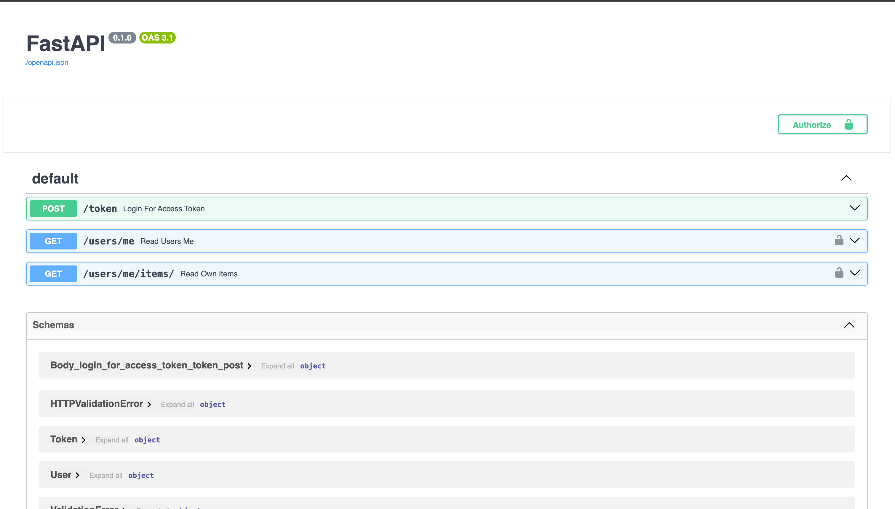

## FastAPI demo API

#### Installation Guide:

create a virtual environment
```bash

python3 -m venv venv

pip install -r requirements.txt
```

#### Running the applications:

Make sure you have redis installed and running:
```bash
brew install redis

brew services start redis
```

Run main app

```
fastapi dev main.py
``` 

Run client: 

```
python client_app.py
```

Finally run the consume app

```
python consumer.py
```

Visiit ```http://localhost:8000/docs```:



